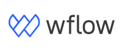

 
# wflow Wiki 

  Take a look at [[Table of content]] to get started on your exploration.

This digital garden of wflow documentation is constantly updated. Feel free to let us know what else should be added. If you find some mistakes or contradictions you're more than welcome to contact us (QA team)

<strong>Recently updated notes</strong>

<ul>
  
  
    <li>
      {{ note.last_modified_at | date: "%Y-%m-%d" }} — <a class="internal-link" href="{{ site.baseurl }}{{ note.url }}">{{ note.title }}</a>
    </li>
  
</ul>

